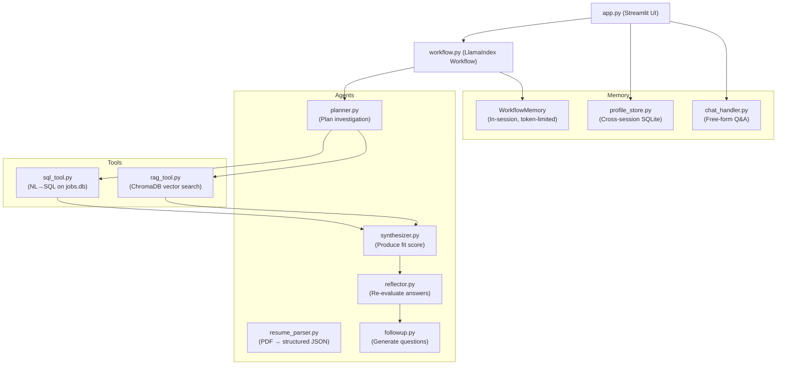

# AI Hiring Co-pilot — Deep Codebase Analysis

## Project Overview

An **end-to-end multi-agent RAG + SQL system** that takes a candidate's resume and a job description and produces an evidence-based fit analysis with follow-up questions, score re-evaluation, and a chat interface.

---

## Architecture



### Workflow Pipeline (LlamaIndex Events)
```
StartEvent
  → plan_step        → PlanEvent
  → execute_tools    → ToolResultsEvent   (SQL + RAG in parallel)
  → synthesize_step  → SynthesisEvent
  → reflect_step     → FollowUpEvent | ReplanEvent (max 2 replan cycles)
  → followup_step    → StopEvent
```

---

## Module-by-Module Breakdown

### `workflow.py` — Orchestration
- **Class**: `RouterOutputAgentWorkflow(Workflow)` — LlamaIndex Workflow with 5 steps
- **`WorkflowMemory`**: Wraps `ChatMemoryBuffer` (4000 token limit), stores labelled entries: RESUME SUMMARY, JOB DESCRIPTION, INVESTIGATION PLAN, KEY SQL FINDINGS, KEY RAG FINDINGS, SYNTHESIS, FOLLOW-UP QUESTIONS
- **Tool caching**: `_SQL_ENGINE` and `_RAG_ENGINE` are module-level singletons (avoid reloading the 80MB embedding model per request)
- **Replan loop**: Max 2 cycles; currently the placeholder `_placeholder_reflect()` never triggers a replan
- **`run_copilot()`**: Synchronous entrypoint that wraps `asyncio.run()` around the async workflow

### `agents/planner.py` — Investigation Planner
- LLM prompt asks for a structured JSON plan BEFORE any tools are called
- Output schema: `sql_queries`, `rag_queries`, `key_skills_to_evaluate`, `initial_gap_hypothesis`, `hybrid_questions`, `investigation_priority`
- Retry logic: one retry with stricter JSON-only instruction on failure
- Model: `openai/gpt-oss-120b:free` via OpenRouter

### `agents/resume_parser.py` — PDF Resume Parser
- PDF text extraction via **pdfplumber** with multi-column fallback (word-clustering)
- Unicode normalization + page number stripping
- LLM produces structured JSON: name, email, phone, education, work_experience, projects, certifications, skills (5 sub-categories), experience_level (fresher/junior/mid/senior)
- `make_sample_pdf()` uses **fpdf2** to generate test PDFs

### `agents/synthesizer.py` — Fit Synthesizer
- Core output: `fit_score` (0-100), `score_breakdown` (skills/experience/culture), `strengths`, `gaps`, `summary`, `recommendation`, `alternative_roles`, `citations`, `confidence`
- **Calibration safety caps**: fresher→senior capped at 45; junior→mid capped at 65
- Recommendation stays consistent with score (`never more optimistic than score supports`)
- Score helpers `clamp_score()` and `recommendation_from_score()` are shared with the reflector

### `agents/reflector.py` — Score Re-evaluator
- Called after candidate answers follow-up questions
- LLM rates each answer as `strong`, `adequate`, or `weak` against hidden `what_good_answer_looks_like` criteria
- Delta table: strong+critical=+10, adequate+critical=+4, strong+moderate=+4, etc.
- Returns updated synthesis with `resolved_gaps`, `remaining_gaps`, `answer_assessments`, `score_delta`

### `agents/followup.py` — Follow-up Question Generator
- Generates up to 3 questions ONLY for `critical`/`moderate` gaps
- Deduplication: never re-asks questions from previous sessions (checked against `previously_asked` list)
- Each question has a hidden `what_good_answer_looks_like` field used by the reflector

---

### `tools/sql_tool.py` — NL→SQL Tool
- **Engine**: `NLSQLTableQueryEngine` over SQLite `jobs.db`
- **Schema**: `jobs` table (50 rows: title, company, location, salary_min/max in LPA, experience_min/max, skills_required, industry, company_stage, remote_friendly, full_description) + `companies` table
- **Robustness**: `RobustSQLParser` recovers SELECT/WITH from prose; `RobustSQLQueryEngine` retries up to 2x when no valid SQL generated
- **Custom prompts**: Separate text-to-SQL prompt (generates raw SQL only) and response-synthesis prompt (natural language from results)

### `tools/rag_tool.py` — RAG Culture Tool
- **Vector store**: ChromaDB (persistent at `database/chroma_store/`)
- **Corpus**: 35 `.txt` files from `tools/corpus_data.py` — 10 culture docs + 15 skill docs + 10 interview docs
- **Embedding**: `BAAI/bge-small-en-v1.5` (local HuggingFace, ~80MB)
- **Indexing**: Auto-builds on first run; subsequent runs load from existing collection
- `similarity_top_k=4`

### `tools/corpus_data.py` — Corpus Content
- All 35 documents are hardcoded Python strings (no external files needed at first run)
- Covers: company culture by stage (seed/series-A/series-B/MNC), skills in practice (PyTorch, Docker, FastAPI, etc.), interview processes

---

### `memory/profile_store.py` — Cross-Session Persistence
- **SQLite DB**: `database/profiles.db`
- **Table**: `candidate_profiles` keyed by MD5 hash of uploaded PDF bytes
- **Stores**: parsed resume JSON, analyses history, follow-up Q&A history, timestamps
- **Returning candidate flow**: Hash lookup → skip re-parsing → load previously asked questions → skip duplicates in follow-ups

### `memory/chat_handler.py` — Chat Interface
- Stateful per-session conversation history (list of role+content dicts)
- LLM call with: system prompt + full memory_context + conversation history + new question
- Grounded in session memory — refuses to invent facts not in context

---

### `app.py` — Streamlit UI
- **Two modes**: Candidate (single resume) and Recruiter (batch analysis + CSV download)
- **Session state**: ~14 keys including resume_dict, analysis_results, reeval_results, chat_handler, memory_context, profile_session_id, returning_profile
- **Lazy imports**: Backend (LLMs, tools) only loaded when analysis button is clicked
- **`@st.cache_resource`**: `ProfileStore` singleton shared across reruns
- **`@st.cache_data`**: Job options dropdown cached from SQLite
- **Colored progress bars** via inline HTML/CSS
- **Score labels**: 🟢 Strong Fit (≥80), 🟡 Possible Fit (≥60), 🟠 Weak Fit (≥40), 🔴 Not Recommended

---

## Data Flow (End to End)

1. User uploads PDF → `pdfplumber` extracts text → LLM parses to JSON resume dict
2. Profile hash checked → returning candidate loads existing profile; new candidate creates one
3. User selects a job (from SQLite dropdown) or pastes a JD
4. "Analyze My Fit" button → `run_copilot(resume_dict, jd)`
5. **Plan**: LLM generates 2-3 SQL queries + 2-3 RAG queries
6. **Execute**: SQL and RAG queries run in parallel via `asyncio.gather`
7. **Synthesize**: LLM produces fit score + strengths/gaps with citations from tool results
8. **Reflect**: Placeholder (never replans currently)
9. **Follow-up**: LLM generates up to 3 questions for critical/moderate gaps
10. Results displayed with score breakdown, strength/gap cards, source badges
11. Candidate answers follow-up questions → `re_evaluate()` → score updates
12. Analysis saved to `profiles.db`
13. Chat interface lets candidate ask free-form questions about the analysis

---

## Key Design Decisions

| Decision | Implementation |
|---|---|
| LLM provider | OpenRouter (`openai/gpt-oss-120b:free`) — changed from original Llama 3.1 70B which was retired |
| Embeddings | Local HuggingFace `BAAI/bge-small-en-v1.5` — no API cost |
| Tool isolation | SQL and RAG errors are caught per-tool; failure of one doesn't kill the other |
| Score calibration | Hard caps applied AFTER LLM output to prevent overoptimistic scores for seniority mismatches |
| Replan loop | Max 2 cycles; currently disabled (placeholder always returns `needs_replan: False`) |
| Cross-session memory | MD5 of PDF bytes as identity key → persistent SQLite |
| In-session memory | `ChatMemoryBuffer` with 4000 token limit |

---

## Current Limitations / Areas to Improve

1. **Reflector replan is a placeholder** — `_placeholder_reflect()` always returns `needs_replan: False`; the full reflector agent in `agents/reflector.py` is only used for post-answer re-evaluation, not in-workflow quality checks
2. **corpus_data.py is huge** (53KB) — all 35 documents hardcoded as strings
3. **No async streaming** in the UI — the `st.status` block just shows static step labels, not live LLM output
4. **Benchmark is empty** — `benchmark/evaluate.py` is 62 bytes (stub) and `test_cases.json` contains `null`
5. **Single LLM for everything** — planner, parser, synthesizer, reflector, followup all call OpenRouter independently (5+ LLM calls per analysis)
6. **No rate limiting / queuing** for the Recruiter batch mode
7. **`data/raw/` and `data/processed/`** appear empty (no sample resume or DB creation script in the clone)
